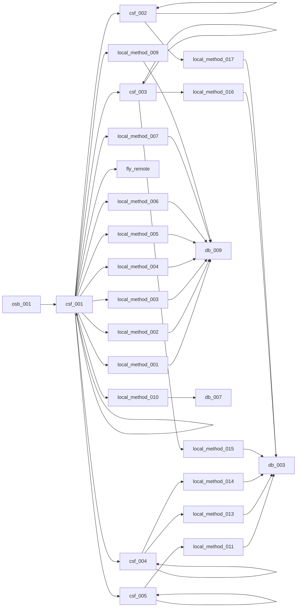

```mermaid
graph LR;
    osb_001 --> csf_001;
    
    csf_001 --> csf_001;
    csf_001 --> csf_002;
    csf_001 --> csf_003;
    csf_001 --> csf_004;
    csf_001 --> csf_005;
    csf_001 --> fly_remote;
    csf_001 --> local_method_001;
    csf_001 --> local_method_002;
    csf_001 --> local_method_003;
    csf_001 --> local_method_004;
    csf_001 --> local_method_005;
    csf_001 --> local_method_006;
    csf_001 --> local_method_007;
    csf_001 --> local_method_009;
    csf_001 --> local_method_010;

    csf_002 --> csf_002;
    csf_002 --> local_method_017;

    csf_003 --> csf_003;
    csf_003 --> local_method_015;
    csf_003 --> local_method_016;

    csf_004 --> csf_004;
    csf_004 --> local_method_013;
    csf_004 --> local_method_014;

    csf_005 --> csf_005;
    csf_005 --> local_method_011;

    local_method_001 --> db_009

    local_method_002 --> db_009

    local_method_003 --> db_009

    local_method_004 --> db_009

    local_method_005 --> db_009

    local_method_006 --> db_009

    local_method_007 --> db_009

    local_method_009 --> db_009

    local_method_010 --> db_007

    local_method_011 --> db_003

    local_method_013 --> db_003

    local_method_014 --> db_003

    local_method_015 --> db_003

    local_method_016 --> db_003

    local_method_017 --> db_003
```

* There is no data for local_method_008 and local_method_012
